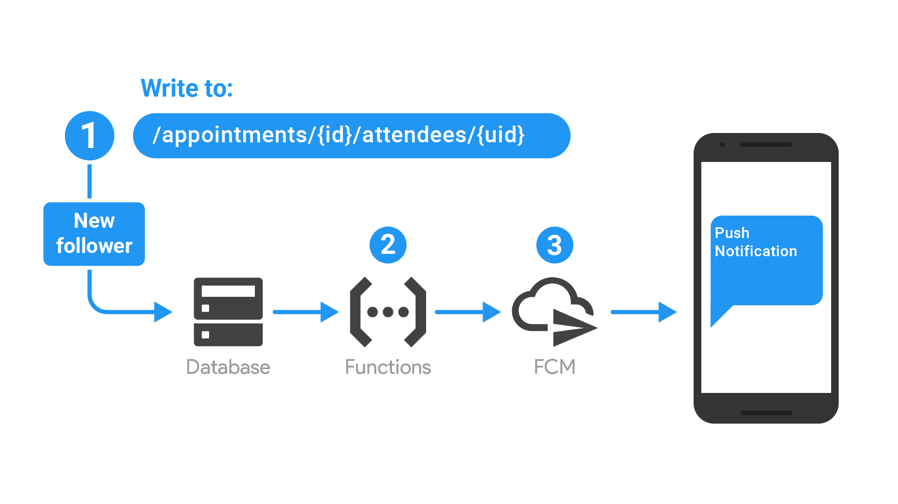

<p align="center">
    
</p>


# Appointments PWA [](https://travis-ci.com/KaindlJulian/appointments-pwa) [](https://depfu.com/github/KaindlJulian/appointments-pwa?project_id=6290)

> Serverless Angular PWA using some Firebase features and Google APIs

Website: https://appointments-pwa.firebaseapp.com

## System 


## Firebase

### :fire: [Authentication](https://firebase.google.com/docs/auth/)

  - Email/Password
  - Google

### <div>🔥<a href="https://firebase.google.com/docs/firestore/">Firestore &#946;</a></div>

  - Data structure

```
  appointments/{appointmentId}: {
      title,
      body,
      date,
      author: {name, email, photoURL},
      attendees: [{name, email, photoURL}, ...]
  },
  users/{uid}: {
      name, 
      email, 
      photoURL
  }
```

### :fire: [Functions](https://firebase.google.com/docs/functions/)
One function to send Push Notifications. ([src](/functions/src/index.ts))
  - Listens for created appointments in Firestore (`onCreate` [trigger](https://firebase.google.com/docs/functions/firestore-events)) 
  - Reads all attendees of the appointment that are actual users (not google contacts)
  - Sends a Notification to the users via their fcmToken and the client side angular service will do the rest

### :fire: [Cloud Messaging](https://firebase.google.com/docs/cloud-messaging/)



### :fire: [Hosting](https://firebase.google.com/docs/hosting/)

Deploying the build with `firebase deploy` or from travis

## Google APIs

The Google login with their api [client](https://developers.google.com/api-client-library/javascript/start/start-js) includes scopes for following Google APIs

- People API (`/contacts/readonly`)
- Google Calendar API (`/auth/calendar`)


## Getting started

Clone the repository

> git clone https://github.com/KaindlJulian/appointments-pwa.git

Install dependencies

> npm install

Development server

> ng serve --open